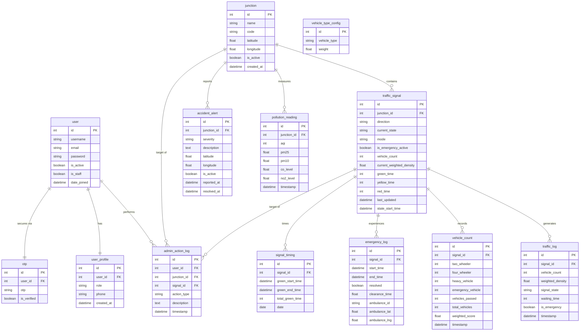

# Smart Traffic AI Project - Entity-Relationship (ER) Diagram

This document contains the Entity-Relationship (ER) diagram reflecting the actual Django models from the `traffic_signal_project` (including User Account configuration, Junctions, Signals, and Logs).

## ER Diagram (Mermaid)

## Entity Descriptions

- **user**: Built-in Django authentication entity representing project users (Admins & Operators).
- **user_profile**: Extends the user model to specify Roles ("operator", "admin") and contact numbers.
- **otp**: Extension mapping generated OTPs for secure login verification.
- **junction**: Represents a physical traffic intersection running the Smart Traffic AI.
- **traffic_signal**: Each junction has multiple signals (Directions) capturing current states, modes (ADAPTIVE, EMERGENCY), and waiting densities.
- **vehicle_type_config**: Configures the dynamic density weighting given to bikes vs. cars vs. heavy vehicles.
- **traffic_log**: Stores historical logs of density changes at given signals.
- **vehicle_count**: Type-wise logs that capture details down to individual counts of 2-wheelers vs. 4-wheelers.
- **emergency_log**: Active and Historical sessions of Ambulance detection, linking GPS coordinates and duration.
- **signal_timing**: Collects Green Light time distribution per signal for analytics purposes.
- **admin_action_log**: System log table recording when admins force manual overrides on signals or junctions.
- **accident_alert**: Events representing flagged roadside anomalies or collisions detected at a specific junction.
- **pollution_reading**: Tracks air-quality logs gathered at the junction level based on emissions.
